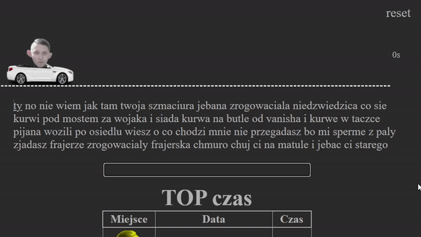

# Szmaciura Racer 🚗

Website 👉 https://szmaciura.pl/



Race to be the fastest across all primary schools, get all the fame and the bitches right now!

Frontend - [Gatsby](https://github.com/gatsbyjs/gatsby/)
Backend - [Express](https://github.com/expressjs/express/) & [Socket.io](https://github.com/socketio/socket.io/)

## Prerequisites

Written and tested on [Node.js](https://nodejs.org) version 14.12.0

## Setup

Get the code by either cloning this repository using git

```
git clone https://github.com/auto200/szmaciura-racer.git
```

... or [downloading source code](https://github.com/auto200/szmaciura-racer/archive/master.zip) code as a zip archive.

Once downloaded, open the terminal in the project directory, and install dependencies with:

```
npm install:all
```

Go to `./server` and create your own `.env` file based on `.env.example`

---

# IMPORTANT

If during development you want to test application on other devices in your local network, then change "start" script in `client/package.json` accordingly:
`"start": "gatsby develop -H HOST_LOCAL_IP -p PORT",`
It defaults to my local ip.
If you don't care about other devices just change it like so:
`"start": "gatsby develop",`
Default port is 8000

Then start the app in main directory with:

```
npm run start
```

The app should now be up and running at http://localhost:8000 🚀 _if not specified otherwise_
